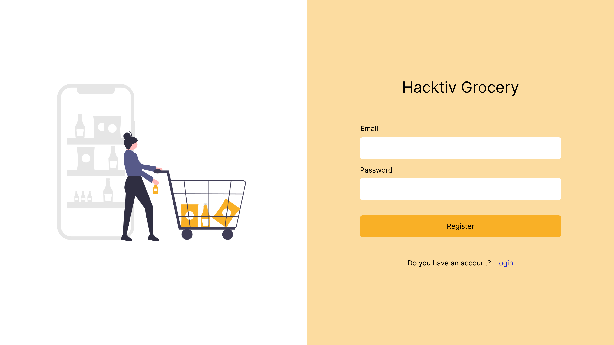
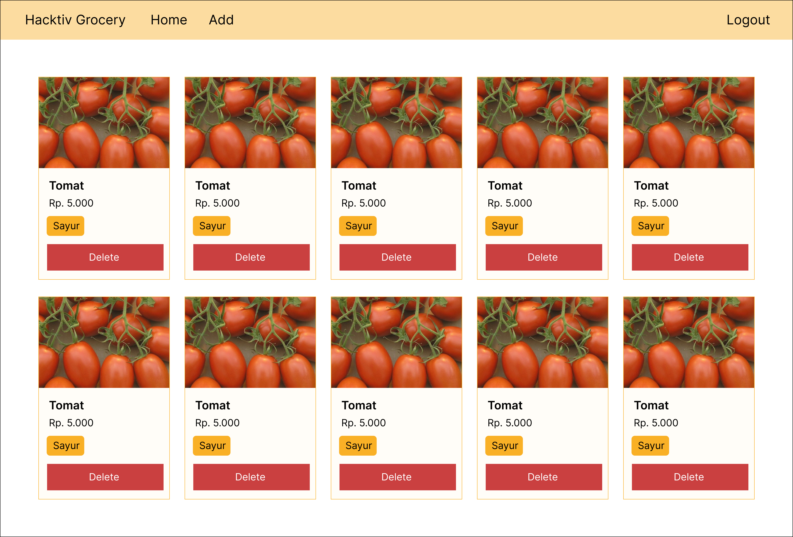
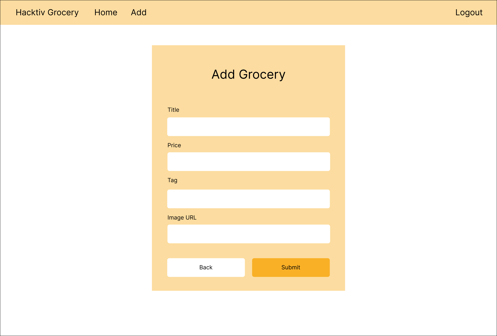

# SLC02 - Hacktiv Grocery

## Ringkasan

Kali ini, Kalian sedang menjadi seorang frontend dan ditugaskan untuk membuat aplikasi client-side bernama `Hacktiv Grocery`, sebuah aplikasi untuk membantu mengatur list grocery kalian. Feature utama dari aplikasi ini adalah:

1. User dapat melakukan register
2. User dapat melakukan login
3. User yang telah login dapat `melihat seluruh list grocery miliknya`
4. User yang telah login dapat `menambahkan data ke list grocery miliknya`
5. User yang telah login dapat `menghapus grocery dari list grocery miliknya`

Dalam tugas ini, Tim Backend kalian sudah menyediakan deployed API Server yang dapat kalian consume, dokumentasi server dapat dilihat pada file [api_doc.md](./api_doc.md). Silahkan kalian buat semua feature sesuai release yang ada pada `README.md` ini!

Semoga sukses!

## Aturan & Kebijakan

- Waktu Pengerjaan: **105 min**
- Student diharapkan menjunjung tinggi INTEGRITAS. Segala bentuk ketidakjujuran meliputi peniruan, plagiarisme, pemalsuan pengerjaan akan mendapatkan tindakan tegas dari akademik
- Error minimal ditampilkan menggunakan `console.log` di client
- (-10) jika `node_modules` tidak diignore
- (-5) jika `package.json` tidak ada, tidak valid atau tidak dipush
- (-5) jika tidak menyertakan example value `.env` bagi yang menggunakan dotenv
- (-2) jika menggunakan `alert` bawaan browser
- (-5) jika tidak menerapkan konsep SPA
- (-5) Error tidak ditampilkan pada client

## Bobot penilaian

- Protecting App
- Basic Web Development & Layouting
- UI Library

## Deployed server

- url : https://api.p2.slc1.foxhub.space
- Registered users :
```js
user1 = { email : 'user1@mail.com', password: 'user1' }
user2 = { email : 'user2@mail.com', password: 'user2' }
```
- Silahkan lakukan register user pada client dengan email yg belum terdaftar (boleh register menggunakan postman terlebih dahulu)

## Components

Buatlah client side kalian yang terdiri dari beberapa component-component berikut:

- Register Page
- Login Page
- Home Page
  - Grocery Card
- Add Grocery Page

## Release 0 - Setup Project

Lakukan setup project dengan menginstall package yang sudah diajarkan sebelumnya yaitu vite, react.js dan react-router. Pada project ini terdapat [api_doc.md](./api_doc.md) dan assets sebagai referensi tampilan web yang diharapkan. Kalian boleh menggunakan framework CSS favorite kalian pada project ini

Catatan:
Tampilan Client Side pada assets hanya sebagai referensi atau contoh tampilan, kalian boleh menyesuaikan tampilan ASALKAN layout atau tata letak komponen sama dengan assets yang sudah diberikan. Kalian boleh fokus untuk menyelesaikan feature dahulu lalu akhiri dengan tampilan yang rapi dan menarik.

## Release 1 - Authentication: Register

- Buatlah route `/register` untuk menampilkan form register user seperti pada gambar berikut
- Jika proses register berhasil maka akan pindah ke halaman login
- Tampilkan pesan error dari server jika terjadi kegagalan dalam melakukan register
- Gunakanlah endpoint [register](./api_doc.md#1-post-register) yang tersedia pada server



## Release 2 - Authentication: Login

- Buatlah route `/login` untuk menampilkan form login user seperti pada gambar berikut
- Jika proses login berhasil maka akan menampilkan semua list grocery milik user yg sedang login
- Pastikan ketika user sudah berhasil login, ketika direfresh maka user tidak harus login lagi
- Gunakanlah endpoint [login](./api_doc.md#2-post-login) yang tersedia pada server


## Release 3 - Home Page (Fetch Groceries)

- Buatlah route `/` untuk menampilkan list grocery di client
- Buatlah Card untuk menampilkan detail dari Grocery dan tambahkan tombol `Delete` pada setiap Card Grocery yang ada
- Terapkan konsep component untuk setiap bagian yang bersifat `reuseable`
- Gunakanlah endpoint [groceries](./api_doc.md#3-get-groceries) yang tersedia pada server



## Release 4 - Add Grocery

- Buatlah route `/add-grocery` untuk menampilkan Form Add Grocery di client
- Integrasikan tombol `Add` pada halaman Home ke halaman Add Grocery
- Jika berhasil melakukan Add Grocery, user akan diredirect ke halaman Home `/`
- Jika berhasil Add Grocery maka list grocery akan bertambah tanpa harus di refresh (Pastikan website kalian reaktif)
- Gunakanlah endpoint [add grocery](./api_doc.md#5-post-groceries) yang tersedia pada server



## Release 5 - Delete Grocery

- Pada halaman Home, Integrasikan tombol `Delete` pada list grocery
- Jika berhasil Delete Grocery maka list grocery user akan berkurang tanpa harus di refresh (Pastikan website kalian reaktif)
- Gunakanlah endpoint [delete grocery](./api_doc.md#4-delete-groceriesid) yang tersedia pada server

## Release 6 - Authentication: Logout

- Buatlah tombol logout dan ketika proses logout berhasil maka akan kembali ke tampilan login
- Pastikan ketika user sudah berhasil logout, ketika direfresh maka user akan ke tampilan login

## Release 7 - Update Grocery

Pada halaman Home, Buatlah tombol `Update` pada masing-masing grocery & Integrasikan fitur Update
- Buatlah route `/update-grocery/:id` untuk menampilkan Form Update Grocery (Terapkan Reusable Form pada `Add Grocery` jika memungkinkan)
- Pastikan data grocery terpopulate dengan baik pada form
- Jika berhasil Update Grocery maka user diarahkan kembali ke halaman home dan ,
- Grocery yang diupdate akan terupdate tanpa harus di refresh (Pastikan website kalian reaktif)
- Gunakanlah endpoint [update grocery](./api_doc.md#6-put-groceriesid) yang tersedia pada server
